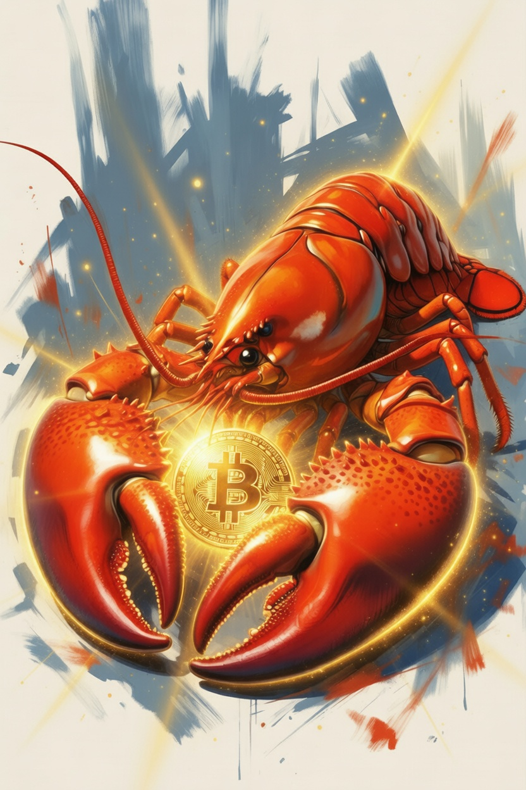

<p align="center">
  
</p>

<h1 align="center">CryptoClaw 🦞</h1>

<p align="center">
  <b>你的 AI 量化交易团队，就在聊天里。</b>
</p>

<p align="center">
  简体中文 | <a href="README.md">English</a>
</p>

---

**CryptoClaw** 是一个 AI 驱动的加密货币量化交易助手，让你用自然语言编写交易策略，通过 Telegram 或 WhatsApp 对话完成所有操作。

## ✨ 特性

- 🗣️ **自然语言策略** - 不需要编程，描述你的策略即可
- 📱 **对话优先界面** - 一切通过 Telegram/WhatsApp 完成
- 📊 **一键回测** - AI 用通俗语言解释结果
- 💰 **有利润才付费** - 免费使用，盈利才收 10%
- 🔐 **本地优先隐私** - API Key 本地加密，永不上传
- 📈 **内置策略** - 包含 BTC/ETH 均值回归策略

## 🚀 快速开始

```bash
# 克隆仓库
git clone https://github.com/franklili3/cryptoclaw.git

# 安装依赖
cd cryptoclaw
npm install

# 启动应用
npm start
```

## 🏗️ 架构

```
┌─────────────────┐     ┌─────────────────┐
│  Telegram/      │     │  桌面客户端     │
│  WhatsApp 机器人│     │  (Electron)     │
│  (对话界面)     │     │  (API Keys)     │
└────────┬────────┘     └────────┬────────┘
         │                       │
         └───────────┬───────────┘
                     │
         ┌───────────┴───────────┐
         │      OpenClaw         │
         │   (AI 代理)           │
         └───────────┬───────────┘
                     │
         ┌───────────┴───────────┐
         │     Freqtrade         │
         │   (量化引擎)          │
         └───────────────────────┘
```

## 💼 商业模式

- ✅ **免费使用** - 无订阅费，无预付费用
- ✅ **有利润才付费** - 利润的 10%，高水位机制
- ✅ **无利润不收费** - 亏损和回本期间不收费

## 🔒 隐私与安全

- 🔐 API Key 本地 AES-256 加密存储
- 🔐 交易数据永不离开你的设备
- 🔐 敏感信息不上云

## 🛠️ 技术栈

| 组件 | 技术 |
|------|------|
| AI 代理 | OpenClaw |
| 量化引擎 | Freqtrade |
| 桌面客户端 | Electron |
| 云服务 | Supabase |
| 消息渠道 | Telegram Bot API |

## 📋 路线图

- [x] 需求文档与架构设计
- [ ] MVP：回测 + 模拟交易
- [ ] 实盘交易集成
- [ ] 支付系统
- [ ] 更多策略

## ⚠️ 免责声明

这是工具，不是投资建议。加密货币交易风险巨大。历史收益不代表未来表现。请自行研究。

## 📄 许可证

MIT License

## 🤝 贡献

欢迎贡献代码！请随时提交 Pull Request。

## 📞 联系方式

- X (Twitter): [@cryptoclaw88](https://x.com/cryptoclaw88)
- GitHub: [franklili3/cryptoclaw](https://github.com/franklili3/cryptoclaw)

---

# 公开构建 🚀

在 X 上关注开发历程：#BuildInPublic #CryptoClaw
